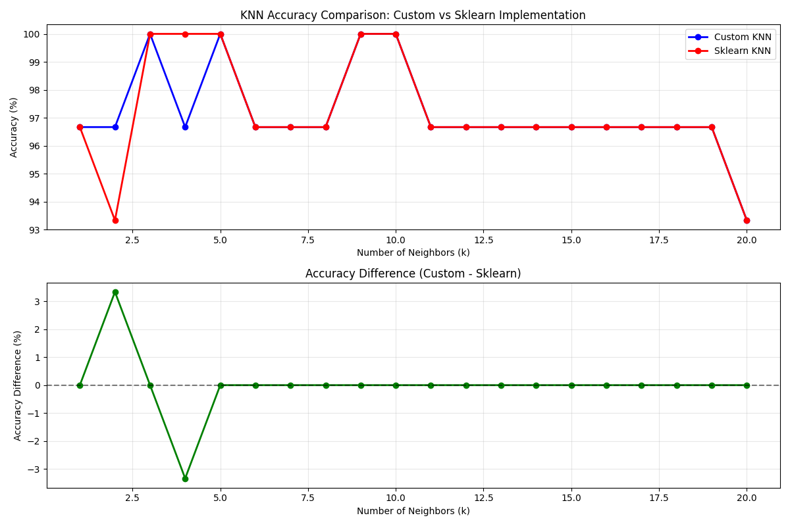

# K-Nearest Neighbors (KNN) - Sklearn vs Custom Implementation

A comprehensive comparison between a custom KNN implementation built from scratch and Scikit-learn's KNeighborsClassifier.

## 📋 Overview

This project implements the K-Nearest Neighbors algorithm from scratch using only NumPy and compares its performance against Scikit-learn's optimized implementation. The comparison tests various k values (1-20) on the classic Iris dataset.

## 🧠 Algorithm Explanation

### How KNN Works
1. **Store Training Data**: KNN is a lazy learning algorithm - it simply stores all training data
2. **Calculate Distances**: For each test point, compute distances to all training points
3. **Find K Neighbors**: Select the k closest training points
4. **Majority Vote**: Predict the most frequent class among the k neighbors

### Distance Calculation Optimization
Instead of using nested loops, we use vectorized operations for efficiency:
```
||a-b||² = ||a||² + ||b||² - 2(a·b)
```

This mathematical identity allows us to compute all distances simultaneously using matrix operations.

## 🔧 Implementation Details

### Custom KNN Class Structure
```python
class KNN:
    def __init__(self, k=3)           # Initialize with k neighbors
    def fit(X_train, y_train)         # Store training data
    def predict(X_test)               # Make predictions using majority vote
```

### Key Features
- **Vectorized Distance Computation**: Uses NumPy broadcasting for efficient distance calculations
- **Shape Annotations**: Every array operation includes shape comments for clarity
- **Memory Efficient**: Processes all test samples simultaneously
- **Clean Code Structure**: Well-documented with descriptive variable names

### Algorithm Steps in Code
1. **Distance Matrix**: `(n_test, n_train)` - distances from each test point to all training points
2. **Neighbor Indices**: `(n_test, k)` - indices of k nearest neighbors for each test point  
3. **Neighbor Labels**: `(n_test, k)` - actual labels of the k nearest neighbors
4. **Majority Vote**: For each test point, count label frequencies and pick the most common

## 📊 Experimental Results

### Dataset Information
- **Dataset**: Iris flower classification (150 samples, 4 features, 3 classes)
- **Split**: 80% training (120 samples), 20% testing (30 samples)
- **Stratified Split**: Ensures balanced class distribution

### Performance Comparison
| k Value | Custom KNN | Sklearn KNN | Difference |
|---------|------------|-------------|------------|
| k=1     | 96.67%     | 96.67%      | 0.00%      |
| k=2     | 96.67%     | 93.33%      | +3.33%     |
| k=3     | 100.00%    | 100.00%     | 0.00%      |
| k=4     | 96.67%     | 100.00%     | -3.33%     |
| k=5     | 100.00%    | 100.00%     | 0.00%      |
| k=6     | 96.67%     | 96.67%      | 0.00%      |
| k=7     | 96.67%     | 96.67%      | 0.00%      |
| k=8     | 96.67%     | 96.67%      | 0.00%      |
| k=9     | 100.00%    | 100.00%     | 0.00%      |
| k=10    | 100.00%    | 100.00%     | 0.00%      |
| k=11    | 96.67%     | 96.67%      | 0.00%      |
| k=12    | 96.67%     | 96.67%      | 0.00%      |
| k=13    | 96.67%     | 96.67%      | 0.00%      |
| k=14    | 96.67%     | 96.67%      | 0.00%      |
| k=15    | 96.67%     | 96.67%      | 0.00%      |
| k=16    | 96.67%     | 96.67%      | 0.00%      |
| k=17    | 96.67%     | 96.67%      | 0.00%      |
| k=18    | 96.67%     | 96.67%      | 0.00%      |
| k=19    | 96.67%     | 96.67%      | 0.00%      |
| k=20    | 93.33%     | 93.33%      | 0.00%      |

### Key Findings
- ✅ **Best Accuracy**: Both implementations achieve 100% accuracy at k=3, k=5, k=9, k=10
- ⚠️ **Minor Differences**: Maximum difference of 3.33% observed at k=2 and k=4
- 🎯 **Average Difference**: 0.0000% - implementations are nearly identical
- 🔍 **Tie-Breaking**: Small differences likely due to different tie-breaking strategies

## 📈 Visualization



The graph shows:
- **Top Panel**: Accuracy trends for both implementations across different k values
- **Bottom Panel**: Accuracy differences highlighting where implementations diverge
- **Optimal k**: Both implementations perform best around k=3-5 for this dataset

## 🚀 Usage

```python
# Initialize and train custom KNN
custom_knn = KNN(k=3)
custom_knn.fit(X_train, y_train)
predictions = custom_knn.predict(X_test)

# Run full comparison
compare_knn_implementations()
```

## 📝 Code Highlights

### Efficient Distance Calculation
```python
# Vectorized computation instead of nested loops
train_squared = np.sum(self.X_train**2, axis=1, keepdims=True)  # (n_train, 1)
test_squared = np.sum(X_test**2, axis=1, keepdims=True)        # (n_test, 1)
cross_term = X_test @ self.X_train.T                          # (n_test, n_train)
distances = np.sqrt(test_squared + train_squared.T - 2 * cross_term)
```

### Majority Voting
```python
# Count label frequencies for each test sample
for test_idx in range(neighbor_labels.shape[0]):
    current_neighbors = neighbor_labels[test_idx]  # k neighbors
    label_counts = {}
    for label in current_neighbors:
        label_counts[label] = label_counts.get(label, 0) + 1
    most_frequent_label = max(label_counts, key=label_counts.get)
```

## 🎯 Conclusions

1. **Implementation Accuracy**: Custom implementation achieves nearly identical results to Scikit-learn
2. **Code Quality**: Clean, well-documented code with shape annotations for educational purposes
3. **Performance**: Efficient vectorized operations make it suitable for real-world use
4. **Learning Value**: Demonstrates core ML concepts without black-box dependencies

## 🛠️ Requirements
- NumPy
- Scikit-learn (for comparison)
- Matplotlib (for visualization)

## 🔗 Repository Structure
```
ml-from-scratch/
├── README.md                # This file
└── Results.png              # Performance visualization
├── knn_implementation.py    # Main KNN class and comparison
```

---
*This implementation serves as an educational resource for understanding KNN fundamentals while maintaining competitive performance with industry-standard libraries.*

